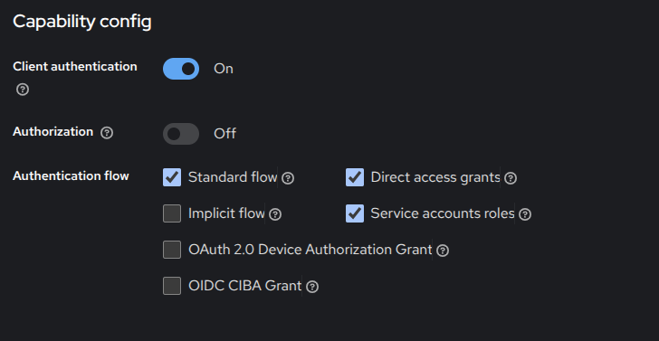

# Deployment  WeCaRe HAPI FHIR Keycloak OAuth 2.0

Getting started HAPI FHIR

https://github.com/hapifhir/hapi-fhir-jpaserver-starter?ref=rob-ferguson

## Ideas and base from HAPI FHIR AU from Rob Ferguson

Starting point [getting started](https://rob-ferguson.me/getting-started-with-hapi-fhir/) and [+ OAuth Part 1](https://rob-ferguson.me/add-authn-to-hapi-fhir-with-oauth2-proxy-nginx-and-keycloak-part-1/)

Github: 

* https://github.com/Robinyo/hapi-fhir-jpaserver-starter
* https://github.com/Robinyo/hapi-fhir-au/

* Rob Ferguson's blog: [Getting Started with HAPI FHIR](https://rob-ferguson.me/getting-started-with-hapi-fhir/)
* Rob Ferguson's blog: [HAPI FHIR and FHIR Implementation Guides](https://rob-ferguson.me/hapi-fhir-and-fhir-implementation-guides/) 
*  Rob Ferguson's blog: [HAPI FHIR and AU Core Test Data](https://rob-ferguson.me/hapi-fhir-and-au-core-test-data/)


## Docker Deployment

Parts:

* nginx 
* hapi-fhir
* postgres
* keycloak
* oauth2-proxy
* redis

build using Dockerfiles in ```services/<part>/Dockerfile``` 

### keycloak

Development realm data can be exported and imported to/from ```development-realm.json```. 
To export realm changes:
```
docker compose stop
docker compose -f docker-compose-keycloak-realm-export.yml up -d
docker compose -f docker-compose-keycloak-realm-export.yml stop
docker compose -f docker-compose-keycloak-realm-export.yml down
docker compose up -d
```

To  realm changes:
```
docker compose stop
docker compose -f docker-compose-keycloak-realm-import.yml up -d
docker compose -f docker-compose-keycloak-realm-import.yml stop
docker compose -f docker-compose-keycloak-realm-import.yml down
docker compose up -d
```

## Adapting for WeCaRe

```/.env``` contains specific configurations 

Do update passwords and secrets. 

To update the OAuth CLIENT_SECRET you have to generate a new Client Secret in the oauth2-proxy Client in the hapi-fhir-dev realm:


To update the URLs consider: development-realm.json

## Keycloak Rest Client


Enable "Direct access grants" to provide user/password authentication.



### Client scopes

In the dedicated client scope "fhire-rest-dedicated" we add a new Audience Mapper ```aud-mapper-fhir-rest```  (type Audience) and a User Attribute Mapper ```username```


### Example Rest Calls

User: grune
Password: 54321
Client Id=fhir-test
Client Secret=uzOr2tn7wMaza8Qp00A7c3f9SxvmLfsx

``` Request Access Token
ACCESS_TOKEN=$(curl -s -X POST https://keycloak.wecare.localhost:8443/realms/hapi-fhir-dev/protocol/openid-connect/token \
  -H 'content-type: application/x-www-form-urlencoded' \
  -d grant_type=password \
  -d username=grune \
  -d password=54321 \
  -d client_id=fhir-rest \
  -d client_secret=uzOr2tn7wMaza8Qp00A7c3f9SxvmLfsx | (jq -r '.access_token'))
```

``` Request Metadata
curl -X GET https://hapi-fhir.wecare.localhost/fhir/metadata \
  -H 'Content-Type: application/fhir+json' \
  -H "Authorization: Bearer $ACCESS_TOKEN"
```

## SSL Certificates 

For development  [mkcert](docs/developer/mkcert.md) 

For prod [Let's Encrypt](docs/developer/lets-encrypt.md) 

## Customization 

Customization for the web interface of the hapi server comes from ```custom-hapi-theme/```. The "wecare" keycloak theme comes from ```custom-keycloak-theme/``` it's a adapted copy of the "keycloak v2" theme with the WeCaRe logo in it.